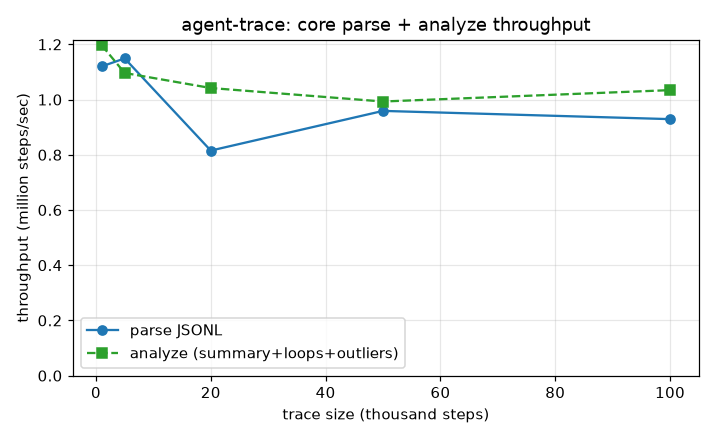

# Benchmarks

The core is TypeScript, so the measurement runs in Node (via its native TypeScript
support), and the graph is rendered separately with matplotlib to match the rest of
parag-labs:

```
npm run bench          # runs bench/benchmark.ts, writes bench/results/summary.json
python bench/plot.py   # renders bench/results/throughput.png
```

`npm run bench` uses `npx tsx` to run the TypeScript directly - no build step and no
new runtime dependency in the app itself.

## Parse and analyze throughput



Best-of-5 per size, single-threaded, on a synthetic trace that mixes model calls,
tool calls, and the occasional error (with timestamps and costs):

| Trace size | Parse | Analyze (summary + loops + outliers) |
|:----------:|:-----:|:------------------------------------:|
| 1,000 | ~1.12M steps/sec | ~1.20M steps/sec |
| 5,000 | ~1.15M steps/sec | ~1.10M steps/sec |
| 20,000 | ~0.82M steps/sec | ~1.04M steps/sec |
| 50,000 | ~0.96M steps/sec | ~0.99M steps/sec |
| 100,000 | ~0.93M steps/sec | ~1.03M steps/sec |

Both parsing and the full analysis pass run at roughly a million steps per second and
stay flat as the trace grows - the work is linear in the number of steps, so
throughput holds rather than falling away. In practical terms, a 100,000-step trace -
far larger than a typical agent run - parses and analyzes in about a tenth of a second
combined. That's the headroom that lets the tool do everything in the browser, on the
main thread, without the UI feeling heavy.

## Why this is the benchmark that matters

agent-trace is a debugging tool: the moment that matters is dropping in a trace and
seeing it render. That cost is parse + analyze, and it's what this measures. There's
no server round-trip, no database query, and no per-frame recomputation to benchmark -
the UI just draws the core's output. So "how fast is the core" is, for this tool,
"how fast does the run show up," and the answer is: faster than you can notice, for
any realistic trace.
