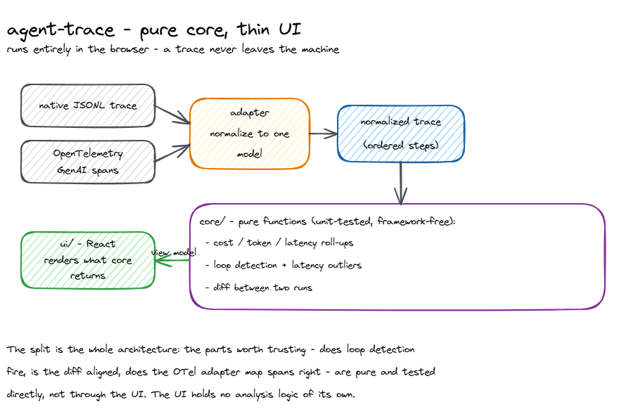

# agent-trace: design, trade-offs, and non-goals

Status: accepted
Author: Parag Sawant

Why agent-trace is structured the way it is. It's a debugging tool for agent runs,
and the thing I cared about most while building it was that the interesting logic -
parsing and analysis - stays honest and testable, and the UI is a thin window onto
it rather than where the work hides.

## Problem and goals

When an agent does something surprising - loops on a tool, burns its budget, stalls
on one slow step - reconstructing what happened from raw JSON logs is miserable. I
wanted to point a tool at a run and see the story: the ordered steps, where the time
and money went, and what looks anomalous. Goals:

1. Turn a trace (native JSONL, or OpenTelemetry GenAI spans) into one normalized
   model, so the rest of the app never cares where it came from.
2. Compute the useful views - cost/token/latency roll-ups, loop detection, latency
   outliers, and a diff between two runs - as pure functions.
3. Run entirely in the browser with no backend, so a trace never leaves the machine
   and the demo is a single static page.

*(Source: [`docs/diagrams/core-ui-flow.excalidraw`](docs/diagrams/core-ui-flow.excalidraw) - editable in [excalidraw](https://aka.ms/excalidraw).)*

## Key design decision: a pure core, a thin UI

The split is deliberate and it's the whole architecture. `core/` is framework-free
TypeScript - parsing, analysis, and diffing are pure functions with their own unit
tests. `ui/` is React that renders what the core returns and holds no analysis logic
of its own.

I did it this way because the parts worth trusting - "does loop detection actually
fire," "is the diff aligned correctly," "does the OTel adapter map spans right" - are
exactly the parts that are painful to test through a UI. Kept pure, they're tested
directly and quickly, and the benchmark can measure them in isolation. The UI then
has a small, boring job: draw a list, expand a row, show a bar. That's the same
"logic is the logic" discipline the rest of parag-labs uses for its tri-language
cores, applied to a web app.

## Trade-offs I made on purpose

- **In-browser, in-memory, single run at a time.** Everything runs locally and a
  trace lives only as long as the tab. That buys zero-setup and privacy (your trace
  never uploads) at the cost of persistence, sharing, and streaming. For "open a run
  and look," that's the right trade; a server-backed history is a different product.
- **Loop detection is a heuristic, not semantic.** It flags tool calls repeated with
  identical arguments - the common "same call, same input" loop. A loop that varies
  its arguments each iteration won't trip it. I chose the version that's cheap,
  explainable, and has no false positives on distinct calls over a cleverer detector
  that would be harder to trust.
- **Hand-rolled SVG/flex for the timeline, no charting library.** The visuals are
  simple bars and rows, so a big charting dependency would be all cost and no benefit.
  Keeps the bundle small and the rendering predictable.
- **The trace has to fit in memory.** This is built to analyze a run, not to stream
  millions of steps. The benchmark shows that "a run" comfortably means hundreds of
  thousands of steps, which covers real agent traces with room to spare.

## Non-goals

- **Not a collector or a backend.** It doesn't ingest live traffic, store runs, or
  serve an API. You bring it a trace file (or a bundled sample) and it renders it.
- **Not tied to a vendor.** The native format is a few fields of JSON, and the OTel
  adapter reads standard `gen_ai.*` attributes - no provider SDK required.
- **Not a metrics dashboard.** It shows one run (or a diff of two), not aggregate
  fleet trends over time.

## Benchmarks

See `BENCHMARKS.md`. Short version: the core parses ~0.9-1.1 million trace steps per
second and runs the full analysis pass (summary + loop detection + latency outliers)
at a similar rate, single-threaded. A 100,000-step trace parses and analyzes in about
a tenth of a second - so the in-browser tool stays snappy well past the size of a
realistic agent run.
